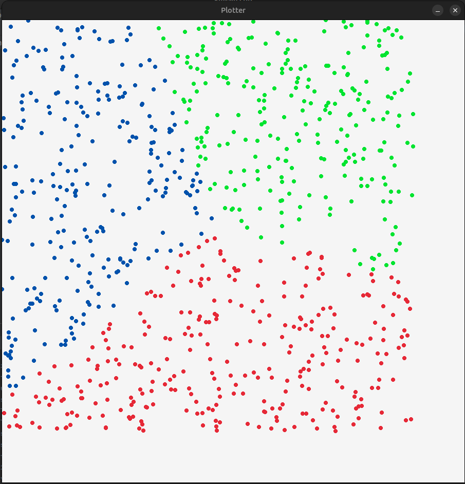

Implementation of k-means clustering algorithm in C++ .

Can even draw a scatter plot for 2D data sets using the raylib library.

### Demo

### Possible Problem
This program generates uniformly distributed random number and then applies the algorithm so this might not look realistic. This is yet to be tested with real world dataset and I have no time for that :)
